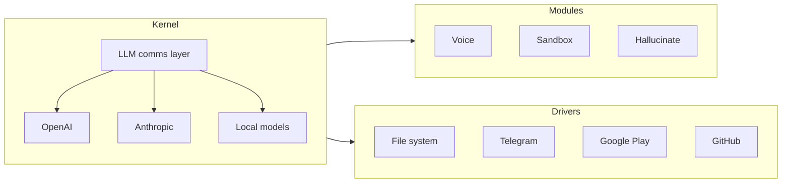

# FreeChaOS

**Free software to command the Agents of ChaOS.**

FreeChaOS is an AI agent operating system. Not a coding assistant — an OS.
You pick the brain (OpenAI, Anthropic, local models), snap in the capabilities you need (modules),
and wire up external services (drivers). It was forked from OpenAI's Codex CLI after one too many
bugs were called features. It runs on a Celeron.

The project name is **FreeChaOS**; the binary is `chaos`. Same pattern as GNU/Linux —
what it stands for vs. what you type.

---

## Architecture

**Kernel** — Talks to LLM providers. OpenAI, Anthropic, local models. This is the only
part that cares about wire protocols and API formats. Provider adapters and
provider-facing protocol shims live with the kernel, not in `drivers/`.

**Modules** — Extend what ChaOS can do. Want voice? Module.
Want a custom tool for your workflow? Module. Everything is modular — ChaOS is not
locked into being a coding agent.

**Drivers** — MCP servers that give ChaOS its tools and connect it to the outside world.
File reading, shell access, Telegram, Google Play — if it speaks MCP, it's a driver.
Plug in, wire up, ship.

---

## Hardware Philosophy

FreeChaOS runs on hardware you assemble from Temu parts. If it can't run on a Core 2 Duo
with 1 GB of RAM, it's out of tree.

Old hardware does not mean old software. FreeChaOS expects bleeding-edge operating systems
and abuses every security primitive they offer:

- **Linux**: landlock, seccomp
- **FreeBSD**: capsicum
- **OpenBSD**: pledge, unveil
- **macOS**: sandbox profiles

No shims. No compatibility layers. If the OS gives us something, we use it.

Windows is not supported.

---

## Clamping / Docking

Anthropic requires MAX subscribers to use the official Claude Code harness.
The Clamping module works within these terms: it launches Claude Code with `--bare`,
strips its built-in tools, and connects through MCP. FreeChaOS provides the tools.
FreeChaOS hooks into the lifecycle. Claude Code becomes the transport.

API key users connect directly through the kernel — no clamping needed.

This architecture is correct usage of both providers' terms of service.

---

## Docs

- [Installing & building from source](./docs/install.md)
- [Adding LLM providers](./docs/adding-providers.md)
- [MCP — connecting tools and services](./docs/mcp.md)
- [Hallucinate — scripting engine](./docs/hallucinate.md)
- [Contributing](./docs/contributing.md)

---

## Status

FreeChaOS is a working system. You can build it, run it, and use it today.

That said, the codebase still carries rust from the upstream fork. The dremel
is charging. Each component needs to be tested before it gets evicted or
replaced — no cowboy deletions, no silent breakage. If it compiles and passes
tests, it ships. If it doesn't, it gets fixed or removed properly.

I'm using it to fix itself.

---

## Origin & Naming

FreeChaOS was forked from [OpenAI Codex CLI](https://github.com/openai/codex).
The fork exists because upstream refused to fix bugs and called them features.
The codebase has since diverged significantly — FreeChaOS is provider-agnostic,
modular, and built for hardware that most projects have forgotten.

The name is a contraction of *Chat OS*, with the deliberate capitalization of `OS`
echoing the BSD family (FreeBSD, OpenBSD, NetBSD). The `Free` prefix is GNU-style
free-as-in-freedom — *not* "open" in the OpenAI sense. OpenAI poisoned that prefix;
this project refuses to inherit it.

**Not to be confused with [ChaosBSD](https://github.com/seuros/ChaosBSD-src)** —
that's a separate project, a FreeBSD driver-staging fork, an OS for humans.
FreeChaOS is an OS for LLMs. Different target, different lineage.

---

Licensed under [Apache-2.0](LICENSE).
