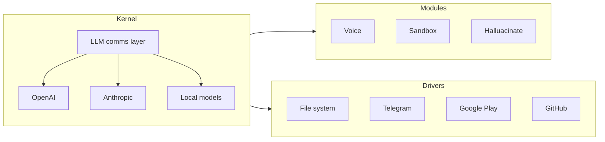

# FreeChaOS

**Free software to command the Agents of ChaOS.**

FreeChaOS is an AI agent operating system. Not a coding assistant — an OS.
You pick the brain (OpenAI, Anthropic, local models), snap in the capabilities you need (modules),
and wire up external services (drivers). It was forked from OpenAI's Codex CLI after one too many
bugs were called features. It runs on a Celeron.

The project name is **FreeChaOS**; the binary is `chaos`. Same pattern as GNU/Linux —
what it stands for vs. what you type.

---

## Architecture


```mermaid
graph LR
  subgraph Kernel
    K[LLM comms layer]
    K --> OpenAI
    K --> Anthropic
    K --> Local["Local models"]
  end

  subgraph Modules
    M1[Voice]
    M2[Sandbox]
    M3[Halluacinate]
  end

  subgraph Drivers
    D1[File system]
    D2[Telegram]
    D3[Google Play]
    D4[GitHub]
  end

  Kernel --> Modules
  Kernel --> Drivers
```

**Kernel** — Talks to LLM providers. OpenAI, Anthropic, local models. This is the only
part that cares about wire protocols and API formats. Provider adapters and
provider-facing protocol shims live with the kernel, not in `drivers/`.

**Modules** — Extend what ChaOS can do. Want voice? Module.
Want a custom tool for your workflow? Module. Everything is modular — ChaOS is not
locked into being a coding agent.

**Drivers** — MCP servers that give ChaOS its tools and connect it to the outside world.
File reading, shell access, Telegram, Google Play — if it speaks MCP, it's a driver.
Plug in, wire up, ship.

For delegated workers and minion instruction boundaries, see
[Minions](./lib/libmisc/minions/README.md).

---

## Hardware Philosophy

FreeChaOS runs on hardware you assemble from Temu parts. If it can't run on a Core 2 Duo
with 1 GB of RAM, it's out of tree.

Old hardware does not mean old software. FreeChaOS expects bleeding-edge operating systems
and abuses every security primitive they offer:

- **Linux**: landlock, seccomp (kernel ≥ 6.10)
- **FreeBSD**: capsicum
- **macOS**: seatbelt sandbox profiles

OpenBSD pledge/unveil is a design target, not an in-tree arch backend yet.
Windows is not supported.

For CI vs release coverage and provider wire formats, see
[chaos-support(7)](./man/chaos-support.7.md).

### Live permissions

Use `/permissions` to change the current session's sandbox and approval policy,
including while the model is working. The change applies to the running turn's
next tool call or retry and to subsequent turns; it does not wait for the model
to finish or interrupt its response. Tool attempts already running retain the
permissions they started with. Enabling Full Access still requires confirmation
unless its warning was previously acknowledged.

---

## Clamping / Docking

Anthropic requires MAX subscribers to use the official Claude Code harness.
The Clamping module works within these terms: it launches Claude Code with settings
discovery disabled, strips its built-in tools, and connects through MCP. FreeChaOS
provides the tools. FreeChaOS hooks into the lifecycle. Claude Code becomes the
transport.

The clamp module also has an experimental Google Antigravity backend. It invokes
the official `agy` CLI in sandboxed print mode, keeps authentication in an
isolated `agy` home, and removes `GEMINI_API_KEY` and `GOOGLE_API_KEY` from the
subprocess environment so a failed subscription connection cannot silently
fall back to metered API billing. Chaos writes a managed MCP configuration for
each dedicated home, denies Antigravity's native command, filesystem, and URL
tools, and exposes the session-scoped Chaos tool bridge as `agy`'s sole action
surface. The bridge socket and capability token are inherited through the
invocation environment and are never persisted in Antigravity configuration.

API key users connect directly through the kernel — no clamping needed.

Headless `chaos exec` sessions can request the clamped transport through the
layered configuration:

```bash
chaos exec --json -c clamp=true -m claude-sonnet-4-5 "say ok"
chaos exec --json -c clamp=true resume <process_id> "continue"

CHAOS_AGY_HOME=/private/antigravity-state \
  chaos exec --json \
  -c clamp=true \
  -c clamp_backend=antigravity \
  -m gemini-3.1-pro-preview \
  "say ok"
```

As with Claude Code, authenticate with the official provider CLI before asking
Chaos to use the transport. Point `agy` at the same dedicated home that Chaos
will receive:

```bash
export CHAOS_AGY_HOME=/private/antigravity-state
export CHAOS_AGY_PATH=/opt/antigravity/bin/agy # optional when agy is in PATH

mkdir -p "$CHAOS_AGY_HOME"
chmod 700 "$CHAOS_AGY_HOME"
env -u GEMINI_API_KEY -u GOOGLE_API_KEY \
  HOME="$CHAOS_AGY_HOME" \
  XDG_CONFIG_HOME="$CHAOS_AGY_HOME/.config" \
  "${CHAOS_AGY_PATH:-agy}" models
```

The official CLI owns login, token refresh, account selection, and logout.
Chaos does not add a second account-management or clamp-lifecycle namespace.
To discard an isolated account when the official CLI has no logout command,
stop sessions using it and remove the dedicated home as one unit.

The effective config for each invocation governs its transport, so resumed
sessions must pass both `-c clamp=true` and any non-default
`-c clamp_backend=...` selection again. Antigravity resumes must also pass the
same `-m` model selection used for the original process. `CHAOS_AGY_PATH` can
pin an explicit `agy` binary, while `CHAOS_AGY_HOME` selects its private
authenticated state. The home must be dedicated to Chaos because each turn
replaces its effective MCP server list and permission policy with the
fail-closed Chaos configuration. If the selected CLI is missing,
unauthenticated, cannot establish the managed bridge, or fails during a turn,
the exec command fails instead of falling back to direct API billing.

Operators are responsible for confirming that their subscription and chosen
first-party CLI usage comply with the provider terms that apply to them.

For a remote service such as souls.house, keep `CHAOS_AGY_HOME` on a persistent
private volume and run the official `agy` login ceremony once in an
operator-controlled environment using that home. Readiness checks should invoke
the official CLI with metered API-key variables removed. Each worker must
receive the same `CHAOS_AGY_HOME`, `CHAOS_AGY_PATH`, and clamp configuration.
Preserve the Chaos process ID between requests and invoke `chaos exec ... resume
<process_id>` with the original `-m` selection so Chaos can restore the matching
provider conversation. Do not copy browser authorization codes into
configuration or logs; only the credential state produced by the official CLI
belongs on the private volume.

---

## Install

```bash
curl -fsSL https://raw.githubusercontent.com/seuros/chaos/master/install.sh | sh
```

By default this downloads GitHub's latest stable prebuilt release for your
OS/CPU into `~/.local/bin`. Override the destination with
`CHAOS_INSTALL_DIR=/path/to/bin`, or pin a specific release tag with
`CHAOS_VERSION=<tag>`.

To build from source instead:

```bash
git clone https://github.com/seuros/chaos.git
cd chaos
just install
```

`just install` builds `bin/chaos` with `-C target-cpu=native` and drops
the binary into `~/.cargo/bin/chaos`. For a one-shot debug run without
installing, use `just chaos`. For a local release run, use
`just bigbang`. See [man/chaos-install.7.md](./man/chaos-install.7.md)
for system requirements and logging controls.

During a running turn, the console status row may show an approximate live token
progress counter such as `~1.2K tokens`. This is a liveness/size indicator for
the current response, not provider usage accounting; exact usage is still shown
from provider-reported token counts when available.

### Dynamic parent reasoning effort

By default, the active model cannot change the reasoning effort of its own
session. To opt in, use the TUI command:

```text
/dynamic-effort on
```

The corresponding persisted setting is:

```toml
dynamic_parent_effort = true
```

When enabled, the parent model receives a `set_parent_effort` tool. A change is
reported visibly and applies to subsequent turns only; it cannot alter the turn
already in progress. Subagents never receive this tool. Use
`/dynamic-effort off` to disable it or `/dynamic-effort status` to inspect the
current setting.

---

## Docs

- [Installing & building from source](./man/chaos-install.7.md)
- [Adding LLM providers](./man/chaos-providers.7.md)
- [Support matrix](./man/chaos-support.7.md)
- [MCP — connecting tools and services](./man/chaos-mcp.7.md)
- [Synopsis — how FreeChaOS coordinates sub-agents](./man/chaos-synopsis.7.md)
- [Attested review — independent multi-model review](./man/chaos-attested-review.7.md)
- [Storage — SQLite and PostgreSQL backends](./man/chaos-storage.7.md)
- [Halluacinate — scripting engine](./man/chaos-halluacinate.7.md)
- [Contributing](./docs/contributing.md)
- [Comparison](./docs/comparison.md)
- [Open source fund](./docs/open-source-fund.md)
- [Manual page index](./man/README.md)

---

## Status

FreeChaOS is a working system. You can build it, run it, and use it today.

That said, the codebase still carries rust from the upstream fork. The dremel
is charging. Each component needs to be tested before it gets evicted or
replaced — no cowboy deletions, no silent breakage. If it compiles and passes
tests, it ships. If it doesn't, it gets fixed or removed properly.

I'm using it to fix itself.

---

## Origin & Naming

FreeChaOS was forked from [OpenAI Codex CLI](https://github.com/openai/codex).
The fork exists because upstream refused to fix bugs and called them features.
The codebase has since diverged significantly — FreeChaOS is provider-agnostic,
modular, and built for hardware that most projects have forgotten.

The name is a contraction of *Chat OS*, with the deliberate capitalization of `OS`
echoing the BSD family (FreeBSD, OpenBSD, NetBSD). The `Free` prefix is GNU-style
free-as-in-freedom — *not* "open" in the OpenAI sense. OpenAI poisoned that prefix;
this project refuses to inherit it.

**Not to be confused with [ChaosBSD](https://github.com/seuros/ChaosBSD-src)** —
that's a separate project, a FreeBSD driver-staging fork, an OS for humans.
FreeChaOS is an OS for LLMs. Different target, different lineage.

---

Licensed under [Apache-2.0](LICENSE).
