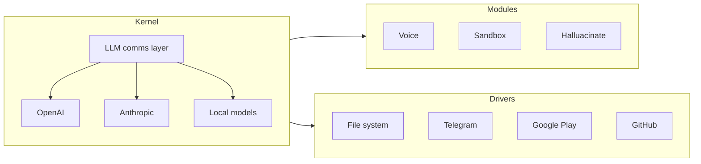

# FreeChaOS

**Free software to command the Agents of ChaOS.**

FreeChaOS is an AI agent operating system. Not a coding assistant — an OS.
You pick the brain (OpenAI, Anthropic, local models), snap in the capabilities you need (modules),
and wire up external services (drivers). It was forked from OpenAI's Codex CLI after one too many
bugs were called features. It runs on a Celeron.

The project name is **FreeChaOS**; the binary is `chaos`. Same pattern as GNU/Linux —
what it stands for vs. what you type.

---

## Architecture


```mermaid
graph LR
  subgraph Kernel
    K[LLM comms layer]
    K --> OpenAI
    K --> Anthropic
    K --> Local["Local models"]
  end

  subgraph Modules
    M1[Voice]
    M2[Sandbox]
    M3[Halluacinate]
  end

  subgraph Drivers
    D1[File system]
    D2[Telegram]
    D3[Google Play]
    D4[GitHub]
  end

  Kernel --> Modules
  Kernel --> Drivers
```

**Kernel** — Talks to LLM providers. OpenAI, Anthropic, local models. This is the only
part that cares about wire protocols and API formats. Provider adapters and
provider-facing protocol shims live with the kernel, not in `drivers/`.

**Modules** — Extend what ChaOS can do. Want voice? Module.
Want a custom tool for your workflow? Module. Everything is modular — ChaOS is not
locked into being a coding agent.

**Drivers** — MCP servers that give ChaOS its tools and connect it to the outside world.
File reading, shell access, Telegram, Google Play — if it speaks MCP, it's a driver.
Plug in, wire up, ship.

For delegated workers and minion instruction boundaries, see
[Minions](./lib/libmisc/minions/README.md).

---

## Hardware Philosophy

FreeChaOS runs on hardware you assemble from Temu parts. If it can't run on a Core 2 Duo
with 1 GB of RAM, it's out of tree.

Old hardware does not mean old software. FreeChaOS expects bleeding-edge operating systems
and abuses every security primitive they offer:

- **Linux**: landlock, seccomp (kernel ≥ 6.10)
- **FreeBSD**: capsicum
- **macOS**: seatbelt sandbox profiles

OpenBSD pledge/unveil is a design target, not an in-tree arch backend yet.
Windows is not supported.

For CI vs release coverage and provider wire formats, see
[chaos-support(7)](./man/chaos-support.7.md).

Machine-profile, live power-source, thermal, and task-scoped filesystem detection
live in [chaos-machine](./lib/libmisc/machine/README.md), exposed through the fresh
`chaos://machine` harness resource. Configurable model warnings request a persistent
checkpoint and operator assistance before risky work. They are not execution
interlocks; see [machine warnings](./man/chaos-mcp.7.md#machine-warnings).
The [top bar](./man/chaos-appearance.7.md#top-bar) shows the same scoped machine
status alongside local time, without blocking rendering on probes.

### Live permissions

Use `/permissions` to change the current session's sandbox and approval policy,
including while the model is working. The change applies to the running turn's
next tool call or retry and to subsequent turns; it does not wait for the model
to finish or interrupt its response. Tool attempts already running retain the
permissions they started with. Enabling Full Access still requires confirmation
unless its warning was previously acknowledged.

### Scrolling the thread

Scroll up with the mouse wheel or trackpad to open the in-app thread history,
including the live response. Scrolling stays within the thread, not the shell's
build output or earlier commands.

`Ctrl+T` also opens the transcript. Use the wheel, arrow keys, or Page Up/Page
Down to navigate; `Ctrl+T` or `q` returns to the composer. For terminal-native
text selection or shell scrollback, use your terminal's mouse-capture bypass
(usually holding Shift).

---

## Right-side inspector

The read-only inspector starts closed. **F4** toggles it on the right when the
terminal is at least 110 columns wide; narrowing the terminal temporarily hides it.
Click the panel or use **Alt+Enter** to focus it. **Esc**, **Tab**, or clicking
back into chat returns keyboard focus to the composer without closing the panel.
Existing **Alt+Shift+H/L** tiling shortcuts resize the focused pane.

The panel shows only MCP resources, not system information already in the bars.
**Left/Right** selects a resource, **Up/Down** or the mouse wheel scrolls, and
**r** reloads the resource list and selected content. Content loads on first use
and selection changes; idle panels do not poll or automatically retry failed reads.
Reads run in the background, with timeouts; closing the panel
or changing sessions cancels pending work.

The panel fetches read-only resource snapshots on demand rather than subscribing.
It does not call tools, execute server-provided UI, or add resource contents to
model history. Binary resources are omitted, text is bounded, and resource templates
requiring parameters are not listed.

## Clamping / Docking

Use an authenticated **Claude Code** or experimental **Antigravity (`agy`)** CLI
as model transport while Chaos provides the tools and approvals. API-key users
connect directly; no clamp needed.

Select `/clamp claude` or `/clamp agy`; `/clamp off` restores the original API
selection. Bare `/clamp` toggles the selected backend.

AGY requires a dedicated authenticated `CHAOS_AGY_HOME`. See
[setup, model selection, and headless/resume usage](man/chaos-providers.7.md#clamp-transports).

---

## Reflex

Reflex provides typed judgments through model-specific backends. Configure them
with `/reflex`; settings live in the database and new keys go to the OS keyring.
Run `/reflex test` or `chaos reflex test` for a synthetic action-risk check with
verdict and latency—no chat history or file contents sent.

The kernel supplies no content policy. See [chaos-reflex(7)](man/chaos-reflex.7.md)
for supported judgments, MCP checks, data sharing, and fallback behavior.

## Install

```bash
curl -fsSL https://raw.githubusercontent.com/seuros/chaos/master/install.sh | sh
```

By default this downloads GitHub's latest stable prebuilt release for your
OS/CPU into `~/.local/bin`. Override the destination with
`CHAOS_INSTALL_DIR=/path/to/bin`, or pin a specific release tag with
`CHAOS_VERSION=<tag>`.
The installer verifies the release's SHA-256 checksum before extraction and
checks the complete binary bundle before installation.

To build from source instead:

```bash
git clone https://github.com/seuros/chaos.git
cd chaos
just install
```

`just install` builds `bin/chaos` with `-C target-cpu=native` and drops
the binary into `~/.cargo/bin/chaos`. For a one-shot debug run without
installing, use `just chaos`. For a local release run, use
`just bigbang`. See [man/chaos-install.7.md](./man/chaos-install.7.md)
for system requirements and logging controls.

### Drivers

Model-facing git and forge tools are not built into `chaos`. They come from
[skipper](https://github.com/seuros/skipper), an external MCP driver vendored
at `drivers/skipper`. Without it the model has no `git_*` tools and no CI or
pull request visibility.

Install the `skipper-mcp` binary with the prebuilt installer:

```bash
curl -fsSL https://raw.githubusercontent.com/seuros/skipper/master/scripts/install.sh | bash
```

Or from this checkout:

```bash
just install-skipper
```

Then register it once as a global stdio server:

```bash
chaos mcp add skipper -- skipper-mcp
```

Local git tools need nothing else. Forge tools appear only for repositories
whose remote points at a forge whose CLI is installed and authenticated: `gh`
for GitHub, `glab` for GitLab, `tea` for Gitea and Forgejo. Run the CLI's
login command once; skipper stores no tokens of its own.

Run `just qa` for formatting, compilation, Clippy, and the all-features nextest
suite (cargo-nextest 0.9.99 or newer). On macOS, nextest launches `chaos-console`
and `libui` test binaries through hard links in `<build-profile>/nextest-ui/`.
This avoids AppKit's pre-main scan of Cargo's large `deps` directory without
raising test timeouts. Explicit target runners take precedence over this wrapper.

During a running turn, the console status row may show an approximate live token
progress counter such as `~1.2K tokens`. This is a liveness/size indicator for
the current response, not provider usage accounting; exact usage is still shown
from provider-reported token counts when available.

### Dynamic parent reasoning effort

By default, the active model cannot change the reasoning effort of its own
session. To opt in, use the TUI command:

```text
/dynamic-effort on
```

The corresponding persisted setting is:

```toml
dynamic_parent_effort = true
```

When enabled, the parent model receives a `set_parent_effort` tool. A change is
reported visibly and applies to subsequent turns only; it cannot alter the turn
already in progress. Subagents never receive this tool. Use
`/dynamic-effort off` to disable it or `/dynamic-effort status` to inspect the
current setting.

---

## Docs

- [Installing & building from source](./man/chaos-install.7.md)
- [Keyboard shortcuts](./man/chaos-keyboard.7.md) — press `?` with an empty input for in-app help
- [Adding LLM providers](./man/chaos-providers.7.md)
- [Support matrix](./man/chaos-support.7.md)
- [MCP — connecting tools and services](./man/chaos-mcp.7.md)
- [Agent roles — standalone definitions](./man/chaos-agents.7.md)
- [Synopsis — how FreeChaOS coordinates sub-agents](./man/chaos-synopsis.7.md)
- [Attested review — independent multi-model review](./man/chaos-attested-review.7.md)
- [Storage — SQLite and PostgreSQL backends](./man/chaos-storage.7.md)
- [Halluacinate — scripting engine](./man/chaos-halluacinate.7.md)
- [Contributing](./docs/contributing.md)
- [Comparison](./docs/comparison.md)
- [Open source fund](./docs/open-source-fund.md)
- [Manual page index](./man/README.md)

---

## Status

FreeChaOS is a working system. You can build it, run it, and use it today.

That said, the codebase still carries rust from the upstream fork. The dremel
is charging. Each component needs to be tested before it gets evicted or
replaced — no cowboy deletions, no silent breakage. If it compiles and passes
tests, it ships. If it doesn't, it gets fixed or removed properly.

I'm using it to fix itself.

---

## Origin & Naming

FreeChaOS was forked from [OpenAI Codex CLI](https://github.com/openai/codex).
The fork exists because upstream refused to fix bugs and called them features.
The codebase has since diverged significantly — FreeChaOS is provider-agnostic,
modular, and built for hardware that most projects have forgotten.

The name is a contraction of *Chat OS*, with the deliberate capitalization of `OS`
echoing the BSD family (FreeBSD, OpenBSD, NetBSD). The `Free` prefix is GNU-style
free-as-in-freedom — *not* "open" in the OpenAI sense. OpenAI poisoned that prefix;
this project refuses to inherit it.

**Not to be confused with [ChaosBSD](https://github.com/seuros/ChaosBSD-src)** —
that's a separate project, a FreeBSD driver-staging fork, an OS for humans.
FreeChaOS is an OS for LLMs. Different target, different lineage.

---

Licensed under [Apache-2.0](LICENSE).
